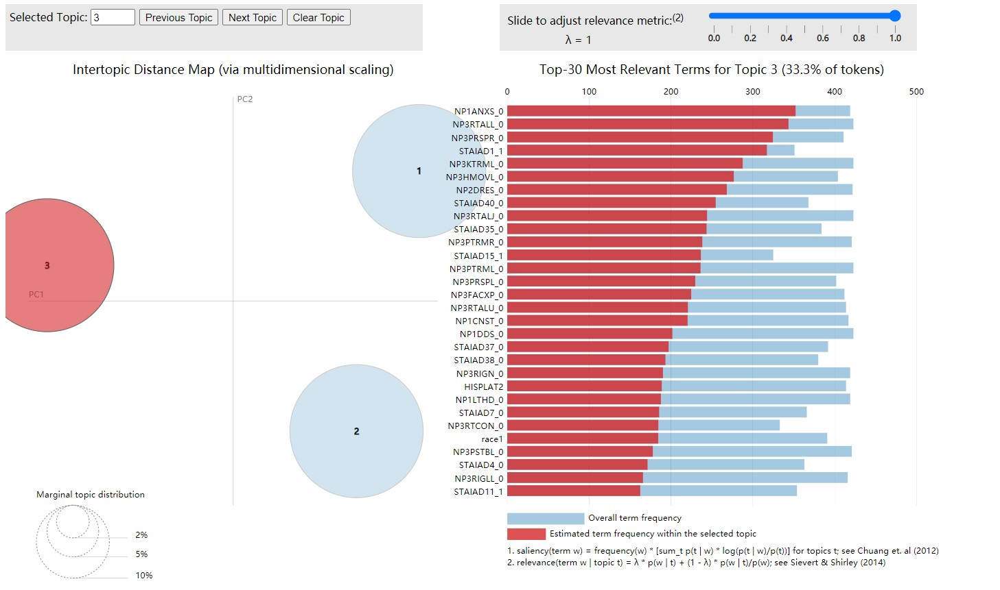

```{r setup, include=FALSE}
knitr::opts_chunk$set(warning = FALSE, message = FALSE)
library(tidyverse)
library(tidytext)
library(topicmodels)
library(tm)
library(wordcloud)
library(maptpx)
library(igraph)
library(maptpx)
library(LDAvis)
library(lda)
library(ldatuning)
library(servr)
library(quanteda)
```

## data import


This dataset includes information:

* Demographic info: APPRDX, HISPLAT, race from PPMI_Original_Cohort_BL_to_Year_5_Dataset_Apr2020.csv
* Prime Diagnosis from "./data/Study_Enrollment/Primary_Diagnosis.csv" (Seldom info collected at baseline contain prime diagnosis)
* Olfactory: UPSITBK1, UPSITBK2, UPSITBK3, UPSITBK4 from University_of_Pennsylvania_Smell_ID_Test.csv which means olfactory score from 4 booklet
* Moca: all related variables from Montreal_Cognitive_Assessment__MoCA_.csv
* Motor: All related variables from MDS_UPDRS_Part_I.csv, MDS_UPDRS_Part_I__Patient_Questionnaire.csv, MDS_UPDRS_Part_II__Patient_Questionnaire.csv, MDS_UPDRS_Part_III.csv, MDS_UPDRS_Part_IV.csv
* Stai: all related variables from State-Trait_Anxiety_Inventory.csv


```{r}
data = read_csv("./data/Clean_Join.csv") %>%  select(-X1select(-X1, -MCATOT))
PD_BL = data %>% filter(APPRDX == "PD",
                        EVENT_ID == "BL") # 423 patients

PD = data%>% filter(APPRDX == "PD") %>% group_by(PATNO) %>% summarise(n = n())
new = merge(data, PD_BL, by = "PATNO", all = FALSE) [,1:146]

PD_V16 = new %>% filter(EVENT_ID.x == "V16") # 15 patients
PD_V15 = new %>% filter(EVENT_ID.x == "V15") # 107 patients
PD_V14 = new %>% filter(EVENT_ID.x == "V14") # 239 patients
PD_V13 = new %>% filter(EVENT_ID.x == "V13") # 273 patients
PD_V12 = new %>% filter(EVENT_ID.x == "V12") # 315 patients

PD_V14 = tibble(PD_V14)
```

There are 423 patients diagnosed as PD at baseline. I use their ID to filter their following observations. Since the last observation (V16) have only 15 patients' information, I chose V14 with 237 patients info to do following compare. 

## data Prepare

```{r}
BL = PD_BL %>% 
  pivot_longer(APPRDX:mctot, names_to = "Variable", values_to = "word") %>% 
  filter(is.na(word) == FALSE)

BLdtm = BL %>% group_by(PATNO,word) %>% count() %>% 
  cast_dtm(PATNO, word, n)

V14 = PD_V14 %>% 
  pivot_longer(APPRDX.x:mctot.x, names_to = "Variable", values_to = "word") %>% 
  filter(is.na(word) == FALSE)

V14dtm = V14 %>% group_by(PATNO,word) %>% count() %>% 
  cast_dtm(PATNO, word, n)
```

## LDA tuning

```{r}
topics = c(2,3,4,5,6,8,10)

BLtune = FindTopicsNumber(
  BLdtm,
  topics = topics,
  metrics = c("CaoJuan2009", "Arun2010", "Deveaud2014"),
  method = "VEM",
  control = list(seed = 2020),
  mc.cores = 2L,
  verbose = TRUE
)
FindTopicsNumber_plot(BLtune) 


V14tune = FindTopicsNumber(
  V14dtm,
  topics = topics,
  metrics = c("CaoJuan2009", "Arun2010", "Deveaud2014"),
  method = "VEM",
  control = list(seed = 2020),
  mc.cores = 2L,
  verbose = TRUE
)
FindTopicsNumber_plot(V14tune) 
```

According to plots above, I choose 3,4,5 as the topic number for both baseline model and V14 model

## LDA vis

```{r}
BLlda3 = LDA(BLdtm, k = 3, control = list(seed = 2020))
BLlda4 = LDA(BLdtm, k = 4, control = list(seed = 2020))
BLlda5 = LDA(BLdtm, k = 5, control = list(seed = 2020))

V14lda3 = LDA(V14dtm, k = 3, control = list(seed = 2020))
V14lda4 = LDA(V14dtm, k = 4, control = list(seed = 2020))
V14lda5 = LDA(V14dtm, k = 5, control = list(seed = 2020))
```

By using `LDAvis`, I create 3 interactive plot to show the topic model result.

```{r eval = FALSE}

# prepare to produce json
topicmodels_json_ldavis = function(fitted, doc_term){
  require(LDAvis)
  require(slam)
  
  ls_LDA = function (phi)
  {
    jensenShannon <- function(x, y) {
      m <- 0.5 * (x + y)
      lhs <- ifelse(x == 0, 0, x * (log(x) - log(m+1e-16)))
      rhs <- ifelse(y == 0, 0, y * (log(y) - log(m+1e-16)))
      0.5 * sum(lhs) + 0.5 * sum(rhs)
    }
    dist.mat <- proxy::dist(x = phi, method = jensenShannon)
    pca.fit <- stats::cmdscale(dist.mat, k = 2)
    data.frame(x = pca.fit[, 1], y = pca.fit[, 2])
  }
  
  # Find required quantities
  phi <- as.matrix(posterior(fitted)$terms)
  theta <- as.matrix(posterior(fitted)$topics)
  vocab <- colnames(phi)
  term_freq <- slam::col_sums(doc_term)
  
  # Convert to json
  json_lda <- LDAvis::createJSON(phi = phi, theta = theta,
                                 vocab = vocab,
                                 doc.length = as.vector(table(doc_term$i)),
                                 term.frequency = term_freq, mds.method = ls_LDA)
  
  return(json_lda)
}

BLjson3 = topicmodels_json_ldavis(BLlda3,BLdtm)
BLjson4 = topicmodels_json_ldavis(BLlda4,BLdtm)
BLjson5 = topicmodels_json_ldavis(BLlda5,BLdtm)

V14json3 = topicmodels_json_ldavis(V14lda3,V14dtm)
V14json4 = topicmodels_json_ldavis(V14lda4,V14dtm)
V14json5 = topicmodels_json_ldavis(V14lda5,V14dtm)

serVis(BLjson3,open.browser = T)
serVis(BLjson4,open.browser = T)
serVis(BLjson5,open.browser = T)

serVis(V14json3,open.browser = T)
serVis(V14json4,open.browser = T)
serVis(V14json5,open.browser = T)

```

According to the LDAvis result, I will choose topic number = 3 in both baseline and V14.

Since I did not find the way to show the interactive html, I attach the screen shot when topic number = 3. I can show you the interactive plot in our meeting.

**Screen shot when topic number = 3 for PD patients in baseline:**





**Screen shot when topic number = 3 for PD patients in V14:**


## Top word in

```{r warning=FALSE, message=FALSE}
BLtopics = tidy(BLlda3, matrix = "beta") 

BLtop_term = BLtopics %>% 
  group_by(topic) %>% 
  top_n(10, beta) %>% 
  ungroup() %>% 
  arrange(topic, -beta)

BLtop_term %>%
  mutate(term = reorder_within(term, beta, topic)) %>%
  ggplot(aes(term, beta, fill = factor(topic))) +
  geom_col(show.legend = FALSE) +
  facet_wrap(~topic, scales = "free") +
  coord_flip() +
  scale_x_reordered()

V14topics = tidy(V14lda3, matrix = "beta") 

V14top_term = V14topics %>% 
  group_by(topic) %>% 
  top_n(10, beta) %>% 
  ungroup() %>% 
  arrange(topic, -beta)

V14top_term %>%
  mutate(term = reorder_within(term, beta, topic)) %>%
  ggplot(aes(term, beta, fill = factor(topic))) +
  geom_col(show.legend = FALSE) +
  facet_wrap(~topic, scales = "free") +
  coord_flip() +
  scale_x_reordered()
```

According to above 2 plots, we can find that patients' Cognitive Assessment measurement take the dominant role in each topics compared with baseline.

## Gamma score

```{r}
BLpat =  tidy(BLlda3, matrix = "gamma")
BLpat %>% arrange(desc(gamma))

V14pat =  tidy(V14lda3, matrix = "gamma")
V14pat %>% arrange(desc(gamma))

```

There is no dominant topic in baseline or V14 according to the gamma score.


